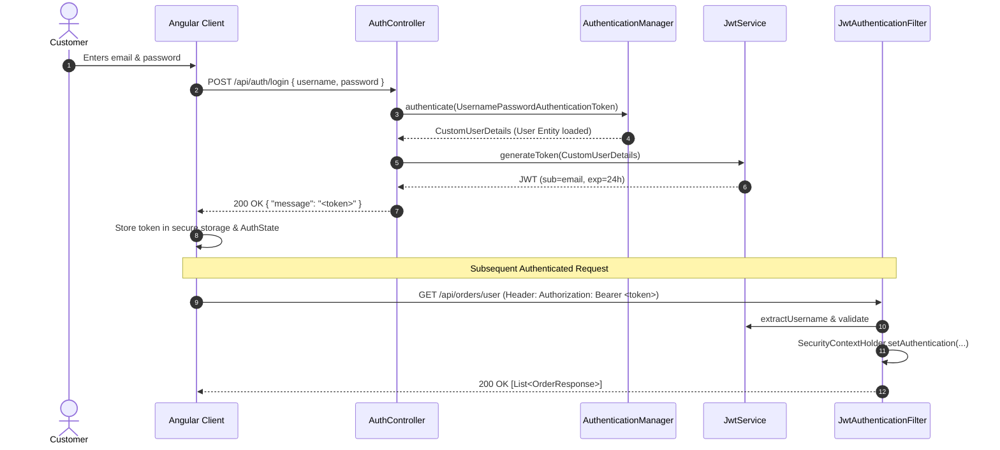
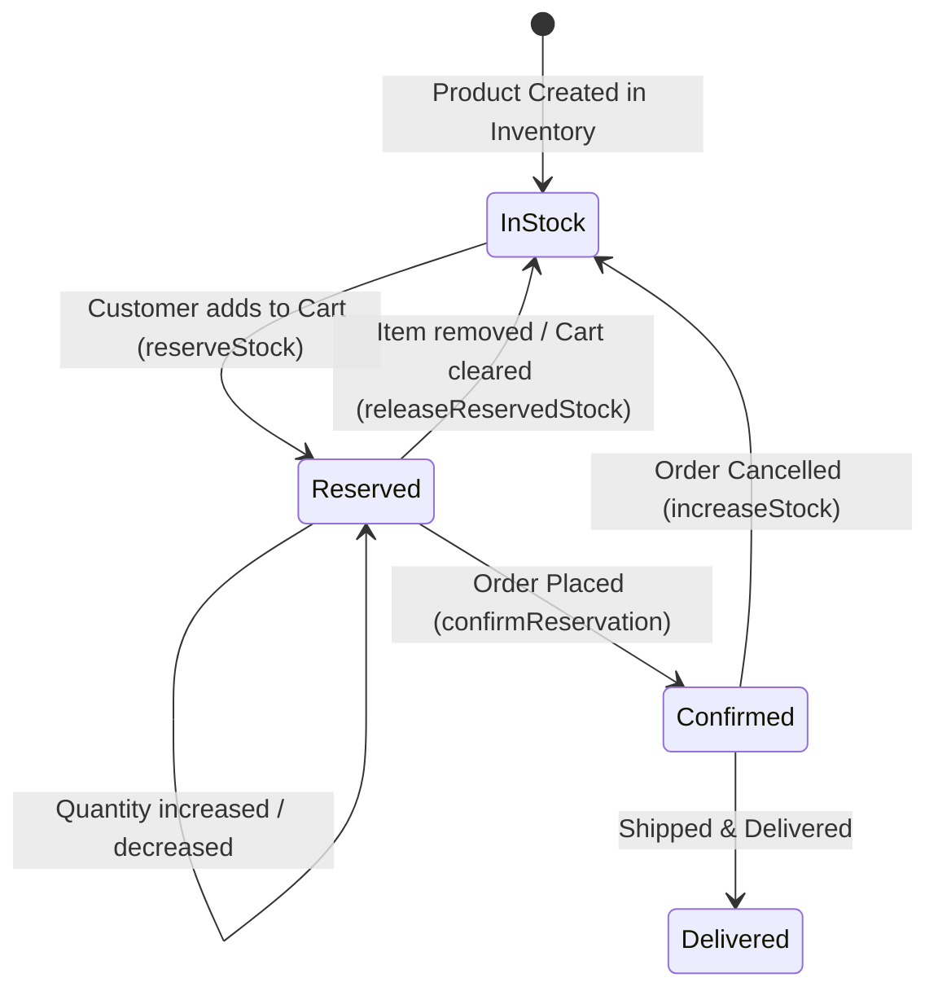
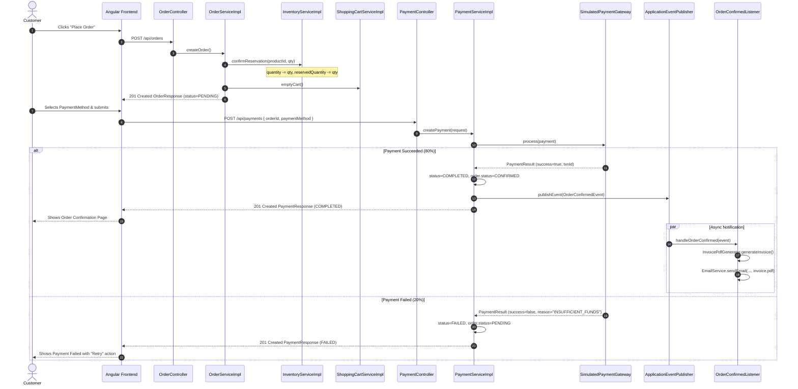
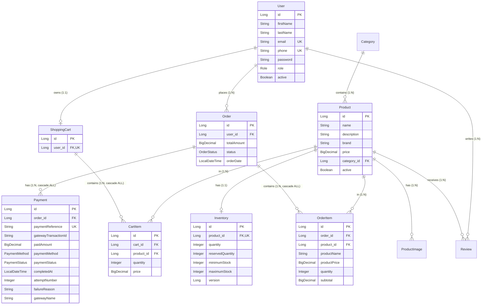
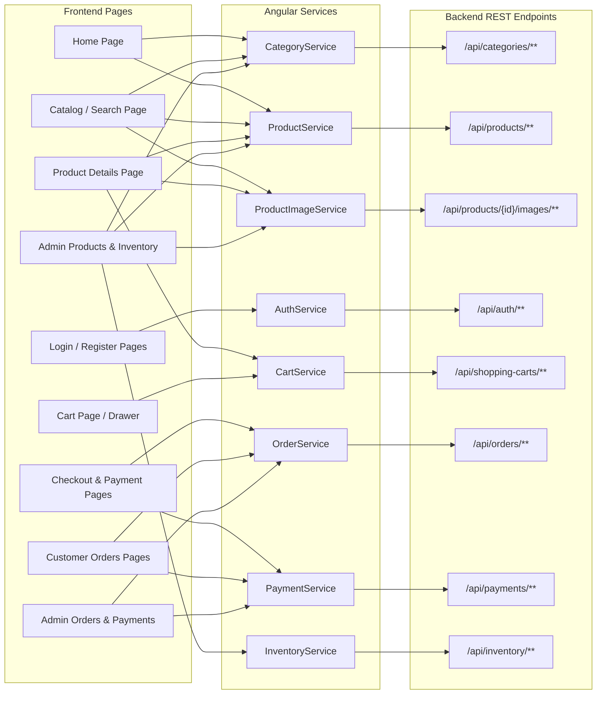
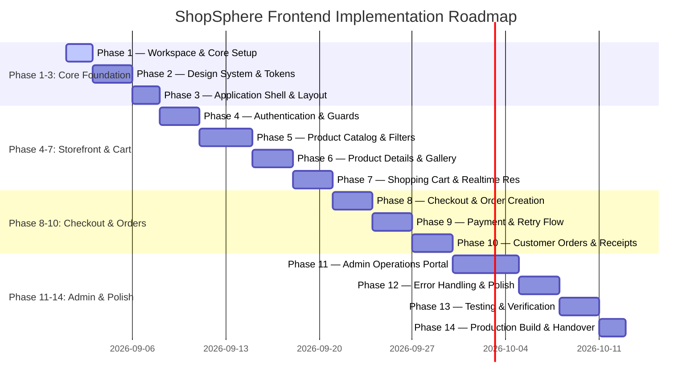

# ShopSphere — Comprehensive Backend Analysis & Frontend Architecture Design

---

## Document Overview & Executive Summary

This architecture document provides an exhaustive, source-code-verified analysis of the **ShopSphere Spring Boot backend** and details the complete architectural blueprint for the future **Angular 19+ standalone frontend application**.

Every statement, endpoint, entity relationship, and business rule in this document is derived directly from the active backend codebase (`com.shopsphere.*`). Where discrepancies, security gaps, or missing backend features exist, they are explicitly cataloged along with practical frontend mitigation strategies.

---

## 1. Backend Overview

### 1.1 Technical Stack & Runtime Environment
* **Language & Runtime:** Java 21 (LTS)
* **Framework:** Spring Boot 4.1.0 (Spring MVC, Spring Data JPA, Spring Security, Spring Validation, Spring Actuator, Spring Mail, Spring Retry, Spring Aspects)
* **Persistence & Database:** MySQL via `mysql-connector-j`, Hibernate 6.x ORM with automatic schema management (`spring.jpa.hibernate.ddl-auto=update`)
* **Security & Tokens:** Spring Security 6.x (Stateless session management, BCrypt password hashing, JJWT `io.jsonwebtoken:jjwt-api:0.12.7` with HMAC-SHA256 signing)
* **Object Mapping:** MapStruct 1.6.3 + Lombok 1.18.38
* **Document Generation & Templating:** OpenPDF 3.0.4 + Thymeleaf 4.1.0 (HTML email templates + PDF invoices)
* **API Documentation:** SpringDoc OpenAPI 2.8.9 (`/swagger-ui/index.html`, `/v3/api-docs`)
* **Default Server Port:** `8000` (`server.port=8000`, context path `/`)

### 1.2 Core Architectural Principles & Patterns
* **Layered Architecture:** Controller $\rightarrow$ Service / ServiceImpl $\rightarrow$ Repository $\rightarrow$ Database Entity.
* **Auditing:** JPA Auditing (`@EnableJpaAuditing`) via `BaseEntity` tracks `createdAt`, `updatedAt`, `createdBy`, and `updatedBy` (sourced dynamically from `AuditorAwareImpl` via Spring Security context).
* **Cross-Cutting Concerns:**
  * `CorrelationIdFilter`: Generates UUID `requestId` stored in SLF4J MDC per request.
  * `RequestLoggingFilter`: Logs incoming HTTP method, URI, status, authenticated username, client IP, and execution time in milliseconds.
  * `GlobalExceptionHandler`: Centralized `@RestControllerAdvice` mapping custom exceptions (`ResourceNotFoundException`, `ResourceAlreadyExistsException`, `BusinessException`, `MethodArgumentNotValidException`) to structured JSON error responses.
  * `JwtAuthenticationEntryPoint` & `JwtAccessDeniedHandler`: Produce structured JSON responses for 401 Unauthorized and 403 Forbidden scenarios.

---

## 2. Backend Domain & Functional Capability Map

```text
ShopSphere Backend
│
├── 1. Authentication & Security Domain
│   ├── Login (JWT generation)
│   ├── Registration (Customer provisioning)
│   └── Event-driven email test trigger
│
├── 2. Category Domain
│   ├── Public category browsing & detail
│   ├── Category-specific product pagination
│   └── Admin category lifecycle (Create, Update, Delete)
│
├── 3. Product Catalog Domain
│   ├── Public product pagination & detail
│   ├── Multi-criteria dynamic specification search
│   └── Admin product management (Create, Update, Soft Delete)
│
├── 4. Product Image & Storage Domain
│   ├── Local filesystem storage (UUID naming, path traversal defense)
│   ├── MIME type and file size validation (JPEG/PNG/WebP, max 5MB)
│   ├── Public image streaming (raw binary resource)
│   └── Admin image upload & physical deletion
│
├── 5. Shopping Cart Domain
│   ├── Cart lifecycle (Create, Add Item, Update Quantity, Remove Item, Clear Cart)
│   └── Real-time inventory reservation & release coupling
│
├── 6. Inventory & Stock Domain
│   ├── Stock allocation (Quantity, Min Stock, Max Stock)
│   ├── Stock adjustments (Increase, Decrease)
│   ├── Stock reservations (Reserve, Release, Confirm)
│   ├── Pessimistic locking & optimistic versioning (`@Version`)
│   └── Event-driven low-stock alerting
│
├── 7. Order Domain
│   ├── Order generation from user cart (Atomic reservation confirmation)
│   ├── Customer order history & detail retrieval
│   ├── Order cancellation with automatic inventory restock
│   └── Admin order workflow management (Strict state transition lifecycle)
│
├── 8. Payment Domain
│   ├── Simulated payment gateway integration (80% success / 20% failure simulation)
│   ├── Payment retry mechanism for failed transactions
│   ├── Customer payment history & lookup by reference/order
│   └── Admin payment auditing & failed payment inspection
│
└── 9. Notifications & Documents Domain
    ├── Asynchronous event listeners (`OrderConfirmedEvent`, `LowStockEvent`)
    ├── PDF invoice generation (OpenPDF)
    └── HTML email dispatch with PDF attachment (JavaMailSender + Thymeleaf)
```

### Module Breakdown & Business Rules

| Module | Purpose | Target Actors | Core Business Rules | Dependencies |
| :--- | :--- | :--- | :--- | :--- |
| **Authentication** | User registration and token issuance. | Public, Customer, Admin | Passwords hashed with BCrypt. JWT valid for 24h. Email and Phone must be globally unique. | Security, User, ShoppingCart |
| **Category** | Manages hierarchical taxonomy for products. | Public (Read), Admin (CRUD) | Category names must be unique (case-insensitive). Deletion cascades or restricts based on DB FK constraints. | JPA, Product |
| **Product** | Manages catalog items. | Public (Read), Admin (CRUD) | Product name unique (case-insensitive). Belongs to a Category. Soft-deletion sets `active=false`. | Category, Inventory, Storage |
| **Product Image** | Physical and metadata storage for product visuals. | Public (Read), Auth/Admin (Manage) | Allowed types: JPEG, PNG, WEBP. Max size: 5MB. Deleting DB entity also deletes physical file on disk. | Product, LocalStorage |
| **Shopping Cart** | Temporary holding for customer purchase items. | Customer | Adding items **immediately reserves inventory**. Updating quantity adjusts reservation. Cart clear releases all reservations. Order placement empties cart without releasing reservations. | User, Product, Inventory |
| **Inventory** | Tracks stock quantity, reserved quantity, thresholds. | Admin (Direct), System/Cart (Automated) | `availableQuantity = quantity - reservedQuantity`. Optimistic locking via `@Version`. Low stock triggers `LowStockEvent`. | Product |
| **Order** | Manages order creation and fulfillment lifecycle. | Customer (Create/View/Cancel), Admin (Manage) | Created from user's shopping cart. Confirms reserved inventory immediately. Status transition follows strict state machine. Cancellation restores stock. | Cart, User, Inventory, Payment |
| **Payment** | Handles financial transactions via simulated gateway. | Customer (Pay/Retry), Admin (Audit) | Linked to single Order. Only `PENDING` orders can be paid. Only `FAILED` payments can be retried. Success sets Order to `CONFIRMED` and triggers invoice email. | Order, User, Notification |
| **Notification** | Asynchronous email & PDF document generation. | System Internal | Listens to `OrderConfirmedEvent`. Runs on dedicated thread pool (`emailTaskExecutor`). Attaches generated PDF invoice. | Mail, Thymeleaf, OpenPDF |

---

## 3. Complete API Inventory

| Feature | Method | Endpoint | Auth Required | Role Required | Path Params | Query Params | Request Body | Response Body | Error Codes | Frontend Usage |
| :--- | :---: | :--- | :---: | :---: | :---: | :---: | :--- | :--- | :---: | :--- |
| **Auth** | `POST` | `/api/auth/login` | No | None | - | - | `LoginRequest` (`username`, `password`) | `LoginResponse` (`message` containing token) | 400, 401 | User authentication form. |
| **Auth** | `POST` | `/api/auth/register` | No | None | - | - | `UserRegistrationRequest` (`firstName`, `lastName`, `email`, `phone`, `password`) | `UserResponse` (`id`, `firstName`, `lastName`, `email`, `phone`) | 400, 409 | User registration form. |
| **Auth** | `POST` | `/api/auth/email` | No | None | - | `orderId` (Long), `paymentId` (Long) | - | `void` (200 OK) | 404 | Test trigger for order email. |
| **Category** | `POST` | `/api/categories` | Yes | `ROLE_ADMIN` | - | - | `CategoryRequest` (`name`, `description`) | `CategoryResponse` (`id`, `name`, `description`) | 400, 401, 403, 409 | Admin Category Creation Modal/Page. |
| **Category** | `GET` | `/api/categories` | No | None | - | - | - | `List<CategoryResponse>` | - | Navigation bar, filter dropdowns, home category grid. |
| **Category** | `GET` | `/api/categories/{id}` | No | None | `id` (Long) | - | - | `CategoryResponse` | 404 | Category detail & edit prefill. |
| **Category** | `PUT` | `/api/categories/{id}` | Yes | `ROLE_ADMIN` | `id` (Long) | - | `CategoryRequest` (`name`, `description`) | `CategoryResponse` | 400, 401, 403, 404, 409 | Admin Category Edit Form. |
| **Category** | `DELETE`| `/api/categories/{id}` | Yes | `ROLE_ADMIN` | `id` (Long) | - | - | `void` (204 No Content) | 401, 403, 404 | Admin Category Delete Action. |
| **Category** | `GET` | `/api/categories/{categoryId}/products` | No | None | `categoryId` (Long) | `page`, `size`, `sort` | - | `Page<ProductResponse>` | 404 | Category-filtered product list view. |
| **Product** | `POST` | `/api/products` | Yes | `ROLE_ADMIN` | - | - | `ProductRequest` (`name`, `description`, `brand`, `price`, `categoryId`) | `ProductResponse` (`id`, `name`, `description`, `brand`, `price`, `categoryId`, `categoryName`) | 400, 401, 403, 404, 409 | Admin Product Creation Form. |
| **Product** | `GET` | `/api/products` | No | None | - | `page`, `size`, `sort` | - | `Page<ProductResponse>` | - | Storefront product catalog listing. |
| **Product** | `GET` | `/api/products/{id}` | No | None | `id` (Long) | - | - | `ProductResponse` | 404 | Product Detail Page. |
| **Product** | `GET` | `/api/products/search` | No | None | - | `keyword`, `categoryId`, `brand`, `minPrice`, `maxPrice`, `inStock`, `page`, `size`, `sort` | - | `Page<ProductResponse>` | - | Catalog search bar, multi-facet filter sidebar. |
| **Product** | `PUT` | `/api/products/{id}` | Yes | `ROLE_ADMIN` | `id` (Long) | - | `ProductRequest` | `ProductResponse` | 400, 401, 403, 404, 409 | Admin Product Edit Form. |
| **Product** | `DELETE`| `/api/products/{id}` | Yes | `ROLE_ADMIN` | `id` (Long) | - | - | `void` (204 No Content) | 401, 403, 404 | Admin Product Soft Delete Action. |
| **Image** | `POST` | `/api/products/{productId}/images` | Yes | Authenticated | `productId` (Long) | - | Multipart Form (`file`) | `ProductImageResponse` (`id`, `fileName`, `originalFileName`, `contentType`, `fileSize`, `url`) | 400, 401, 404 | Admin Product Image Uploader. |
| **Image** | `GET` | `/api/products/{productId}/images` | No | None | `productId` (Long) | - | - | `List<ProductImageResponse>` | 404 | Product Gallery / Thumbnail display. |
| **Image** | `GET` | `/api/products/{productId}/images/{imageId}`| No | None | `productId` (Long), `imageId` (Long) | - | - | Binary Image Resource (`Resource`) | 404 | `` tag direct source. |
| **Image** | `DELETE`| `/api/products/{productId}/images/{imageId}`| Yes | `ROLE_ADMIN` | `productId` (Long), `imageId` (Long) | - | - | `void` (204 No Content) | 401, 403, 404 | Admin Image Gallery Delete Button. |
| **Cart** | `POST` | `/api/shopping-carts/users` | Yes | Authenticated | - | - | - | `ShoppingCartResponse` (`id`, `userId`, `items`, `totalItems`, `totalAmount`) | 400, 401 | Explicit cart initialization. |
| **Cart** | `POST` | `/api/shopping-carts/users/items` | Yes | Authenticated | - | - | `CartItemRequest` (`productId`, `quantity`) | `ShoppingCartResponse` | 400, 401, 404 | Product Page / Quick "Add to Cart". |
| **Cart** | `PATCH` | `/api/shopping-carts/users/items/{productId}` | Yes | Authenticated | `productId` (Long) | - | `UpdateCartItemQuantityRequest` (`quantity`) | `ShoppingCartResponse` | 400, 401, 404 | Cart Drawer/Page quantity increment/decrement. |
| **Cart** | `DELETE`| `/api/shopping-carts/users/items/{productId}` | Yes | Authenticated | `productId` (Long) | - | - | `ShoppingCartResponse` | 401, 404 | Cart Item remove button. |
| **Cart** | `DELETE`| `/api/shopping-carts/users/clear` | Yes | Authenticated | - | - | - | `ShoppingCartResponse` | 401, 404 | Cart "Empty Cart" button. |
| **Order** | `POST` | `/api/orders` | Yes | Authenticated | - | - | - | `OrderResponse` (`id`, `userId`, `totalAmount`, `status`, `orderDate`, `items`) | 400, 401, 404 | Checkout "Place Order" button. |
| **Order** | `GET` | `/api/orders/{orderId}` | Yes | Authenticated | `orderId` (Long) | - | - | `OrderResponse` | 401, 404 | Order Confirmation & Detail Page. |
| **Order** | `GET` | `/api/orders/user` | Yes | Authenticated | - | - | - | `List<OrderResponse>` | 401 | Customer "My Orders" listing. |
| **Order** | `DELETE`| `/api/orders/{orderId}` | Yes | Authenticated | `orderId` (Long) | - | - | `void` (204 No Content) | 400, 401, 404 | Customer / Admin Cancel Order button. |
| **Order** | `PATCH` | `/api/orders/{orderId}/status` | Yes | `ROLE_ADMIN` | `orderId` (Long) | `status` (`OrderStatus`) | - | `OrderResponse` | 400, 401, 403, 404 | Admin Order Status Workflow dropdown. |
| **Order** | `GET` | `/api/orders` | Yes | `ROLE_ADMIN` | - | `page`, `size`, `sort` | - | `Page<OrderResponse>` | 401, 403 | Admin Order Management Table. |
| **Order** | `GET` | `/api/orders/status/{status}` | Yes | `ROLE_ADMIN` | `status` (`OrderStatus`) | `page`, `size`, `sort` | - | `Page<OrderResponse>` | 401, 403 | Admin Filter Orders by Status. |
| **Order** | `GET` | `/api/orders/user/{userId}/page` | Yes | `ROLE_ADMIN` | `userId` (Long) | `page`, `size`, `sort` | - | `Page<OrderResponse>` | 401, 403 | Admin Customer Order Inspection. |
| **Payment** | `POST` | `/api/payments` | Yes | `ROLE_CUSTOMER` | - | - | `CreatePaymentRequest` (`orderId`, `paymentMethod`) | `PaymentResponse` (`id`, `paymentReference`, `gatewayTransactionId`, `paidAmount`, `paymentMethod`, `paymentStatus`, `completedAt`) | 400, 401, 403, 404 | Checkout Payment Gateway Submission. |
| **Payment** | `POST` | `/api/payments/{paymentId}` | Yes | `ROLE_CUSTOMER` | `paymentId` (Long) | - | - | `PaymentResponse` | 400, 401, 403, 404 | Payment Retry Button on failed transaction. |
| **Payment** | `GET` | `/api/payments/me` | Yes | Authenticated | - | - | - | `List<PaymentResponse>` | 401 | Customer Payment History tab. |
| **Payment** | `GET` | `/api/payments/reference/{paymentReference}` | Yes | Authenticated | `paymentReference` (String) | - | - | `PaymentResponse` | 401, 404 | Payment Receipt Verification. |
| **Payment** | `GET` | `/api/payments/order/{orderId}` | Yes | `ROLE_CUSTOMER` | `orderId` (Long) | - | - | `PaymentResponse` | 401, 403, 404 | Order Payment Status tracker. |
| **Payment** | `GET` | `/api/payments` | Yes | `ROLE_ADMIN` | - | - | - | `List<PaymentResponse>` | 401, 403 | Admin All Payments Ledger. |
| **Payment** | `GET` | `/api/payments/failed` | Yes | `ROLE_ADMIN` | - | - | - | `List<PaymentResponse>` | 401, 403 | Admin Failed Transactions Monitor. |
| **Inventory** | `POST` | `/api/inventory` | Yes | `ROLE_ADMIN` | - | - | `InventoryRequest` (`productId`, `quantity`, `minimumStock`, `maximumStock`) | `InventoryResponse` (`id`, `productId`, `productName`, `quantity`, `reservedQuantity`, `availableQuantity`, `minimumStock`, `maximumStock`) | 400, 401, 403, 404, 409 | Admin Product Inventory Initializer. |
| **Inventory** | `PATCH` | `/api/inventory/products/{productId}/increase` | Yes | `ROLE_ADMIN` | `productId` (Long) | - | `StockUpdateRequest` (`quantity`) | `InventoryResponse` | 400, 401, 403, 404 | Admin Restock Action. |
| **Inventory** | `PATCH` | `/api/inventory/products/{productId}/decrease` | Yes | `ROLE_ADMIN` | `productId` (Long) | - | `StockUpdateRequest` (`quantity`) | `InventoryResponse` | 400, 401, 403, 404 | Admin Write-off / Damaged Stock adjustment. |
| **Inventory** | `PATCH` | `/api/inventory/products/{productId}/reserve` | Yes | `ROLE_ADMIN` | `productId` (Long) | - | `StockUpdateRequest` (`quantity`) | `InventoryResponse` | 400, 401, 403, 404 | Admin Manual Stock Reservation. |
| **Inventory** | `PATCH` | `/api/inventory/products/{productId}/release` | Yes | `ROLE_ADMIN` | `productId` (Long) | - | `StockUpdateRequest` (`quantity`) | `InventoryResponse` | 400, 401, 403, 404 | Admin Manual Stock Reservation Release. |
| **Inventory** | `PATCH` | `/api/inventory/products/{productId}/confirm` | Yes | `ROLE_ADMIN` | `productId` (Long) | - | `StockUpdateRequest` (`quantity`) | `InventoryResponse` | 400, 401, 403, 404 | Admin Manual Stock Reservation Confirmation. |

---

## 4. Authentication Architecture & Analysis

### 4.1 Token Lifecycle & Structure
1. **Login Submission:** The client sends `POST /api/auth/login` with body:
   ```json
   {
     "username": "user@example.com",
     "password": "SecretPassword123"
   }
   ```
   *(Note: The DTO field is `username` with `@Email` validation).*
2. **Authentication Flow:** Spring Security's `AuthenticationManager` invokes `DaoAuthenticationProvider` $\rightarrow$ `CustomUserDetailsService.loadUserByUsername()` $\rightarrow$ queries MySQL `users` table $\rightarrow$ verifies password hash via `BCryptPasswordEncoder`.
3. **Token Generation:** `JwtService.generateToken()` issues an HMAC-SHA256 signed JWT with:
   * `sub` (Subject): User's email (`user@example.com`)
   * `iat` (Issued At): Timestamp
   * `exp` (Expiration): Timestamp + 86,400,000 ms (exactly 24 hours)
   * **Crucial Discovery:** The token contains **NO role claim**, **NO user ID claim**, and **NO name claim**.
4. **Backend Response:** `LoginResponse` returns the token inside the JSON field `message`:
   ```json
   {
     "message": "eyJhbGciOiJIUzI1NiJ9.eyJzdWIiOiJ1c2VyQGV4YW1wbGUuY29tIiwiaWF0IjoxNzg4MTg5...,"
   }
   ```
5. **Client Request Transmission:** Every authenticated HTTP request must include:
   ```http
   Authorization: Bearer <token>
   ```
6. **Token Interception:** `JwtAuthenticationFilter` intercepts the request, extracts the username from `sub`, re-loads `UserDetails` from database via `CustomUserDetailsService`, validates expiration, and sets `UsernamePasswordAuthenticationToken` in `SecurityContextHolder`.



---

## 5. Authorization & Role-Based Access Control

### 5.1 Role Definitions
* `ROLE_CUSTOMER`: Default role assigned to all registered users upon `POST /api/auth/register`.
* `ROLE_ADMIN`: Administrative role with privileges to manage categories, products, inventory, orders, and review payments. Default seeded account: `admin@shopsphere.com` / `admin123`.

### 5.2 Security Layer Comparison: Filter Chain vs Method Security
* **Web Security Filter Chain (`SecurityConfig.java`):**
  * `permitAll()`: `/api/auth/**`, `GET /api/products/**`, `GET /api/categories/**`, `/swagger-ui/**`, `/v3/api-docs/**`.
  * `authenticated()`: All other endpoints require a valid Bearer token.
* **Method Security (`@EnableMethodSecurity`, `@PreAuthorize`):**
  * `hasRole('ADMIN')`: Category creation/mutation/deletion, Product creation/mutation/deletion, Product Image deletion, Inventory operations, Order status updates, Admin order queries (`GET /api/orders`, `/status/{status}`, `/user/{userId}/page`), Admin payment queries (`GET /api/payments`, `/failed`).
  * `hasRole('CUSTOMER')`: `POST /api/payments`, `POST /api/payments/{paymentId}`, `GET /api/payments/order/{orderId}`.

### 5.3 Route Access Matrix

| URL Pattern | Method | Public | Customer | Admin | Security Mechanism |
| :--- | :---: | :---: | :---: | :---: | :--- |
| `/api/auth/**` | `POST` | Yes | Yes | Yes | Filter Chain (`permitAll`) |
| `/api/categories/**` | `GET` | Yes | Yes | Yes | Filter Chain (`permitAll`) |
| `/api/categories/**` | `POST`, `PUT`, `DELETE` | No | No | Yes | Method Security (`@PreAuthorize("hasRole('ADMIN')")`) |
| `/api/products/**` | `GET` | Yes | Yes | Yes | Filter Chain (`permitAll`) |
| `/api/products/**` | `POST`, `PUT`, `DELETE` | No | No | Yes | Method Security (`@PreAuthorize("hasRole('ADMIN')")`) |
| `/api/products/{id}/images` | `POST` | No | Yes | Yes | Filter Chain (`authenticated()`) |
| `/api/products/{id}/images/{imageId}` | `DELETE` | No | No | Yes | Method Security (`@PreAuthorize("hasRole('ADMIN')")`) |
| `/api/shopping-carts/**` | All | No | Yes | Yes | Filter Chain (`authenticated()`) |
| `/api/orders` | `POST` | No | Yes | Yes | Filter Chain (`authenticated()`) |
| `/api/orders/{id}`, `/api/orders/user` | `GET` | No | Yes | Yes | Filter Chain (`authenticated()`) |
| `/api/orders/{id}` | `DELETE` | No | Yes | Yes | Filter Chain (`authenticated()`) |
| `/api/orders/{id}/status` | `PATCH` | No | No | Yes | Method Security (`@PreAuthorize("hasRole('ADMIN')")`) |
| `/api/orders`, `/api/orders/status/*`, `/api/orders/user/*/page`| `GET` | No | No | Yes | Method Security (`@PreAuthorize("hasRole('ADMIN')")`) |
| `/api/payments`, `/api/payments/{id}` | `POST` | No | Yes | No | Method Security (`@PreAuthorize("hasRole('CUSTOMER')")`) |
| `/api/payments/order/{orderId}` | `GET` | No | Yes | No | Method Security (`@PreAuthorize("hasRole('CUSTOMER')")`) |
| `/api/payments/me`, `/api/payments/reference/*` | `GET` | No | Yes | Yes | Filter Chain (`authenticated()`) |
| `/api/payments`, `/api/payments/failed` | `GET` | No | No | Yes | Method Security (`@PreAuthorize("hasRole('ADMIN')")`) |
| `/api/inventory/**` | All | No | No | Yes | Method Security (`@PreAuthorize("hasRole('ADMIN')")`) |

---

## 6. Detailed Customer Business Flows

### 6.1 Customer Registration & Login Flow
1. **Registration:** User submits `firstName`, `lastName`, `email`, `phone` (10 digits), `password` (8-100 chars).
2. Backend checks uniqueness of email and phone. If duplicate, throws `400 Bad Request` (`BusinessException`).
3. User is persisted with role `ROLE_CUSTOMER`. Response returns `UserResponse` (`id`, `firstName`, `lastName`, `email`, `phone`).
4. **Registration does NOT automatically log in or return a JWT.** The frontend must redirect the user to `/login`.
5. **Login:** User submits `username` (email) and `password`.
6. Backend verifies credentials and returns `{ "message": "<token>" }`.
7. Frontend extracts token, stores it in browser storage, initializes authenticated state, and redirects to target route or storefront.

### 6.2 Catalog Browsing & Search Flow
1. **Home / Catalog Page:** Frontend calls `GET /api/categories` to render taxonomy tabs/dropdowns, and `GET /api/products?page=0&size=12&sort=name,asc` to load initial catalog cards.
2. **Filtering & Search:** User enters keyword or applies brand/category/price/inStock filters. Frontend invokes `GET /api/products/search?keyword=...&categoryId=...&brand=...&minPrice=...&maxPrice=...&inStock=true&page=0&size=12`.
3. **Image Resolution:** Because `ProductResponse` contains no image URLs or image arrays, the frontend requests `GET /api/products/{productId}/images` to obtain image records, using the generated `/api/products/{productId}/images/{imageId}` URL for ``.

### 6.3 Shopping Cart & Real-Time Inventory Reservation Flow
1. **Add to Cart:** User clicks "Add to Cart" for a product. Frontend calls `POST /api/shopping-carts/users/items` with `{ productId, quantity }`.
2. **Backend Execution:**
   * Finds or creates cart for user (`getOrCreateCart`).
   * Validates product is active.
   * **Calls `inventoryService.reserveStock(productId, quantity)`**: Checks if `availableQuantity (quantity - reservedQuantity) >= quantity`. Throws `BusinessException` ("Not enough stock available") if insufficient.
   * Increments `reservedQuantity` in DB.
   * Upserts `CartItem` in cart and calculates total amount.
   * Returns complete updated `ShoppingCartResponse`.
3. **Quantity Change:** User adjusts quantity to `N`. Frontend calls `PATCH /api/shopping-carts/users/items/{productId}` with `{ quantity: N }`.
   * Difference $\Delta = N - \text{current}$.
   * If $\Delta > 0$: calls `reserveStock(productId, \Delta)`.
   * If $\Delta < 0$: calls `releaseReservedStock(productId, |\Delta|)`.
   * Returns updated `ShoppingCartResponse`.
4. **Item Removal:** Calls `DELETE /api/shopping-carts/users/items/{productId}` $\rightarrow$ releases all reserved stock for that item $\rightarrow$ deletes `CartItem` $\rightarrow$ returns `ShoppingCartResponse`.
5. **Clear Cart:** Calls `DELETE /api/shopping-carts/users/clear` $\rightarrow$ releases reserved stock for all items $\rightarrow$ clears cart $\rightarrow$ returns empty `ShoppingCartResponse`.



### 6.4 Checkout, Order Creation & Payment Lifecycle
1. **Initiate Checkout:** User navigates to checkout.
2. **Order Placement:** Frontend calls `POST /api/orders`.
   * Backend retrieves current user's cart. Validates cart is not empty.
   * Creates `Order` with `status = PENDING`.
   * For each `CartItem`, creates `OrderItem` and executes `inventoryService.confirmReservation(productId, quantity)` (which decrements both `quantity` and `reservedQuantity` permanently).
   * Empties user's cart via `shoppingCartService.emptyCart()`.
   * Returns `OrderResponse` (containing `orderId`, `totalAmount`, `status=PENDING`).
3. **Payment Submission:** Frontend prompts customer to choose payment method (`CARD`, `UPI`, `NET_BANKING`, `WALLET`, `CASH_ON_DELIVERY`) and calls `POST /api/payments` with `{ orderId, paymentMethod }`.
4. **Gateway Execution (`SimulatedPaymentGateway`):**
   * **Success (80% probability):**
     * `paymentStatus` set to `COMPLETED`.
     * `completedAt` timestamp populated.
     * Order status updated from `PENDING` $\rightarrow$ `CONFIRMED`.
     * `OrderConfirmedEvent` published $\rightarrow$ Asynchronous listener generates PDF invoice and sends email to customer.
     * Returns `PaymentResponse` (`paymentStatus = COMPLETED`). Frontend displays success confirmation screen.
   * **Failure (20% probability):**
     * `paymentStatus` set to `FAILED` with `failureReason = "INSUFFICIENT_FUNDS"`.
     * Order status remains `PENDING`.
     * Returns `PaymentResponse` (`paymentStatus = FAILED`). Frontend displays retry screen.
5. **Payment Retry Flow:** Customer clicks "Retry Payment". Frontend calls `POST /api/payments/{paymentId}`.
   * Backend verifies order ownership and validates payment is `FAILED`.
   * Increments `attemptNumber` and re-runs gateway simulation.



### 6.5 Order Cancellation Flow
1. Customer views order in "My Orders" and clicks "Cancel Order" on a `PENDING`, `CONFIRMED`, or `PACKED` order.
2. Frontend calls `DELETE /api/orders/{orderId}`.
3. Backend validates status (throws `400 Bad Request` if `SHIPPED`, `DELIVERED`, or `CANCELLED`).
4. For every order item, backend calls `inventoryService.increaseStock(productId, quantity)` restoring physical inventory.
5. Order status updated to `CANCELLED`. Returns `204 No Content`.

---

## 7. Detailed Admin & Operations Flow

```mermaid
graph TD
    Admin([Administrator]) --> CatMgmt[Category Management]
    Admin --> ProdMgmt[Product Management]
    Admin --> ImgMgmt[Image Management]
    Admin --> InvMgmt[Inventory Management]
    Admin --> OrdMgmt[Order Management]
    Admin --> PayAudit[Payment Auditing]

    CatMgmt -->|POST / PUT / DELETE| API_Cat[/api/categories]
    ProdMgmt -->|POST / PUT / DELETE| API_Prod[/api/products]
    ImgMgmt -->|POST / DELETE| API_Img[/api/products/{id}/images]
    InvMgmt -->|POST / PATCH increase/decrease| API_Inv[/api/inventory]
    OrdMgmt -->|PATCH status / GET all| API_Ord[/api/orders]
    PayAudit -->|GET all / failed| API_Pay[/api/payments]
```

### Admin Operational Capabilities
1. **Category Management:**
   * Create category (`POST /api/categories`) with unique name.
   * Edit category (`PUT /api/categories/{id}`).
   * Delete category (`DELETE /api/categories/{id}`).
2. **Product Catalog Management:**
   * Create product (`POST /api/products`) with `name`, `description`, `brand`, `price`, `categoryId`.
   * Update product (`PUT /api/products/{id}`).
   * Soft-delete product (`DELETE /api/products/{id}` $\rightarrow$ sets `active=false`).
3. **Product Image Management:**
   * Upload image (`POST /api/products/{productId}/images`) as `multipart/form-data`.
   * Delete image (`DELETE /api/products/{productId}/images/{imageId}`) $\rightarrow$ deletes DB record and filesystem file.
4. **Inventory Operations:**
   * Initialize inventory for product (`POST /api/inventory` with `quantity`, `minimumStock`, `maximumStock`).
   * Increase physical stock (`PATCH /api/inventory/products/{productId}/increase` with `{ quantity }`).
   * Decrease physical stock (`PATCH /api/inventory/products/{productId}/decrease` with `{ quantity }`). Triggers `LowStockEvent` if quantity $\le$ `minimumStock`.
   * Manual reservation / release / confirmation actions for stock reconciliation.
5. **Order Lifecycle Workflow:**
   * View all orders with pagination (`GET /api/orders?page=0&size=20`).
   * Filter orders by status (`GET /api/orders/status/{status}`).
   * Advance order status (`PATCH /api/orders/{orderId}/status?status=...`).
   * **Strict State Transition Rules Enforced by Backend:**
     * `PENDING` $\rightarrow$ `CONFIRMED` or `CANCELLED`
     * `CONFIRMED` $\rightarrow$ `PACKED` or `CANCELLED`
     * `PACKED` $\rightarrow$ `SHIPPED` or `CANCELLED`
     * `SHIPPED` $\rightarrow$ `DELIVERED`
     * `DELIVERED` and `CANCELLED` are terminal states (any attempt to transition throws `400 BusinessException`).
6. **Payment Auditing:**
   * View full payment log (`GET /api/payments`).
   * Inspect failed transactions and failure reasons (`GET /api/payments/failed`).

---

## 8. Data Model & Entity Relationship Analysis



### Entity Annotations & Mapping Nuances
* `BaseEntity`: All entities inherit `id`, `active` (boolean), `createdAt`, `updatedAt`, `createdBy`, and `updatedBy`.
* `Inventory.version`: Annotated with `@Version` for optimistic concurrency control during stock reservation.
* `CartItem`: Unique constraint on `(cart_id, product_id)`.
* `Review`: Entity and repository exist (`user_id`, `product_id`, `rating`, `comment`), but **no REST controller or service endpoints are implemented in the backend**.
* `Payment`: One-to-Many with `Order` because an order can have multiple payment attempts if earlier attempts fail.

---

## 9. Frontend Page Inventory

### 9.1 Public Pages

#### 1. Home / Landing Page (`/`)
* **Purpose:** Showcase brand hero banner, featured categories, trending products, value propositions, and direct shopping entry points.
* **Access:** Public.
* **APIs Used:** `GET /api/categories`, `GET /api/products?page=0&size=8&sort=createdAt,desc`.
* **Main UI Sections:** Hero Carousel, Category Showcase Grid, New Arrivals Grid, Features/Trust Badges, Newsletter Subscription.
* **Important States:** Initial skeleton loading, category load failure, product fetch success, empty catalog.
* **Navigation:** Click category $\rightarrow$ `/products?category=X`; Click product $\rightarrow$ `/products/:id`; Click "Shop All" $\rightarrow$ `/products`.

#### 2. Product Catalog / Search Page (`/products`)
* **Purpose:** Browsing, searching, and multi-facet filtering of all products.
* **Access:** Public.
* **APIs Used:** `GET /api/products/search`, `GET /api/categories`, `GET /api/products/{id}/images`.
* **Main UI Sections:** Top Search Bar, Category Filter Chips, Price Range Slider, Brand Multi-select, In-Stock Toggle, Sort Dropdown (`name,asc`, `price,asc`, `price,desc`), Responsive Product Grid, Pagination Bar.
* **Important States:** Loading spinner/skeleton, filtered results view, zero search results matching query, API error state.
* **Navigation:** Click product $\rightarrow$ `/products/:id`; Click "Add to Cart" $\rightarrow$ opens Cart Drawer.

#### 3. Product Details Page (`/products/:id`)
* **Purpose:** Comprehensive product specification, image gallery, stock check, and cart purchasing.
* **Access:** Public.
* **APIs Used:** `GET /api/products/{id}`, `GET /api/products/{id}/images`, `POST /api/shopping-carts/users/items`.
* **Main UI Sections:** Breadcrumb Navigation, Main Image Viewer + Thumbnail Gallery Carousel, Product Meta (Brand, Title, Category Badge), Formatted Price Display, Quantity Selector, "Add to Cart" Button, Product Description Accordion.
* **Important States:** Product loading, image gallery loading, out of stock indicator, add-to-cart in progress, add-to-cart success toast, 404 Product Not Found.
* **Navigation:** Back to Category $\rightarrow$ `/products?category=X`; "Buy Now" $\rightarrow$ adds to cart and navigates to `/cart`.

#### 4. User Login Page (`/login`)
* **Purpose:** Authenticate existing users and issue JWT token.
* **Access:** Public (Redirects to `/` or `/checkout` if already logged in).
* **APIs Used:** `POST /api/auth/login`.
* **Main UI Sections:** Login Card, Email Input, Password Input with toggle visibility, "Remember Me", Login CTA, Link to Registration (`/register`).
* **Important States:** Form pristine/dirty/invalid, submitting spinner, invalid credentials error alert (`401`), server error alert (`500`).
* **Navigation:** On success $\rightarrow$ redirect to saved return URL (e.g. `/checkout`) or `/`; Click Register $\rightarrow$ `/register`.

#### 5. User Registration Page (`/register`)
* **Purpose:** Register new customer account.
* **Access:** Public (Redirects if already authenticated).
* **APIs Used:** `POST /api/auth/register`.
* **Main UI Sections:** Registration Card, First Name & Last Name Inputs, Email Input, Phone Input (10 digits), Password Input with strength meter, Terms Checkbox, Register CTA.
* **Important States:** Client-side validation errors, email/phone already taken error (`400/409`), submission in-progress, registration success modal.
* **Navigation:** On success $\rightarrow$ redirect to `/login` with success banner; Click Login $\rightarrow$ `/login`.

---

### 9.2 Customer Pages

#### 6. Shopping Cart Page & Drawer (`/cart`)
* **Purpose:** Manage cart items, adjust quantities, review subtotal, and proceed to checkout.
* **Access:** Customer (`ROLE_CUSTOMER` / Authenticated).
* **APIs Used:** `PATCH /api/shopping-carts/users/items/{productId}`, `DELETE /api/shopping-carts/users/items/{productId}`, `DELETE /api/shopping-carts/users/clear`.
* **Main UI Sections:** Cart Items Table/List (Image, Name, Unit Price, Quantity Stepper, Item Subtotal, Remove Button), Cart Summary Card (Total Items, Total Price), Clear Cart Button, "Proceed to Checkout" CTA.
* **Important States:** Cart loading, updating quantity spinner, empty cart state with "Start Shopping" button, stock reservation error toast.
* **Navigation:** Click Product $\rightarrow$ `/products/:id`; Click "Checkout" $\rightarrow$ `/checkout`.

#### 7. Checkout Page (`/checkout`)
* **Purpose:** Review order summary, place order, and proceed to payment.
* **Access:** Customer (`ROLE_CUSTOMER` / Authenticated, Cart must not be empty).
* **APIs Used:** `POST /api/orders`.
* **Main UI Sections:** Order Review Summary (Items, Quantities, Subtotal), Shipping/Customer Information (read-only from auth state), Terms & Conditions, "Place Order" CTA.
* **Important States:** Processing order creation spinner, empty cart guard redirect, order creation failure alert.
* **Navigation:** On order creation success $\rightarrow$ navigate immediately to `/payment/:orderId`.

#### 8. Payment Page (`/payment/:orderId`)
* **Purpose:** Select payment method, simulate payment transaction, and handle retries.
* **Access:** Customer (`ROLE_CUSTOMER` / Authenticated, Order owner).
* **APIs Used:** `GET /api/orders/{orderId}`, `POST /api/payments`, `POST /api/payments/{paymentId}`.
* **Main UI Sections:** Order Header (Order #, Total Amount Due), Payment Method Selector (Card, UPI, Net Banking, Wallet, Cash on Delivery), Simulated Payment Warning/Notice, "Pay Now" CTA, Payment Failure Dialog with "Retry Payment" button.
* **Important States:** Fetching order details, processing payment animation, payment success redirect, payment failed alert with error reason (`INSUFFICIENT_FUNDS`).
* **Navigation:** On payment success $\rightarrow$ `/order-confirmation/:orderId?paymentId=X`; On failure $\rightarrow$ stay on page with retry button.

#### 9. Order Confirmation Page (`/order-confirmation/:orderId`)
* **Purpose:** Celebrate successful purchase, display order and transaction details, and confirm email dispatch.
* **Access:** Customer (`ROLE_CUSTOMER` / Authenticated).
* **APIs Used:** `GET /api/orders/{orderId}`, `GET /api/payments/order/{orderId}`.
* **Main UI Sections:** Success Celebration Banner, Order Number, Payment Reference, Transaction ID, Itemized Bill, Email Notification Notice ("Invoice PDF sent to your email"), "Continue Shopping" button, "View My Orders" button.
* **Important States:** Loading receipt data, receipt display.
* **Navigation:** "Continue Shopping" $\rightarrow$ `/products`; "My Orders" $\rightarrow$ `/orders`.

#### 10. Customer Orders History Page (`/orders`)
* **Purpose:** View full history of customer's past orders and their fulfillment statuses.
* **Access:** Customer (`ROLE_CUSTOMER` / Authenticated).
* **APIs Used:** `GET /api/orders/user`, `DELETE /api/orders/{orderId}`.
* **Main UI Sections:** Orders List/Cards grouped by date, Order Status Badges (`PENDING`, `CONFIRMED`, `PACKED`, `SHIPPED`, `DELIVERED`, `CANCELLED`), Item Count, Total Price, "View Details" button, "Cancel Order" action (enabled for `PENDING`/`CONFIRMED`/`PACKED`).
* **Important States:** Loading skeletons, no orders placed yet state, order cancellation confirmation dialog.
* **Navigation:** Click Order Card $\rightarrow$ `/orders/:orderId`.

#### 11. Customer Order Details Page (`/orders/:orderId`)
* **Purpose:** Inspect deep details of a specific order, payment attempts, and cancellation option.
* **Access:** Customer (`ROLE_CUSTOMER` / Authenticated).
* **APIs Used:** `GET /api/orders/{orderId}`, `GET /api/payments/order/{orderId}`, `DELETE /api/orders/{orderId}`.
* **Main UI Sections:** Order Status Stepper Timeline (`PENDING` $\rightarrow$ `CONFIRMED` $\rightarrow$ `PACKED` $\rightarrow$ `SHIPPED` $\rightarrow$ `DELIVERED`), Detailed Items List, Pricing Breakdown, Payment Details Card, Cancel Order CTA.
* **Important States:** Loading, cancellation in progress, cancelled state.
* **Navigation:** Back to Orders $\rightarrow$ `/orders`.

#### 12. Customer Payment History Page (`/payments`)
* **Purpose:** View history of financial transactions and payment references.
* **Access:** Customer (`ROLE_CUSTOMER` / Authenticated).
* **APIs Used:** `GET /api/payments/me`.
* **Main UI Sections:** Payments Table (Payment Reference, Order ID, Date, Method, Amount, Status Badge).
* **Important States:** Loading, empty payments history.
* **Navigation:** Click Order ID $\rightarrow$ `/orders/:orderId`.

---

### 9.3 Admin Pages

#### 13. Admin Dashboard Overview (`/admin`)
* **Purpose:** Central operational hub with quick status metrics and navigation to management modules.
* **Access:** Admin (`ROLE_ADMIN` only).
* **APIs Used:** `GET /api/orders?page=0&size=5`, `GET /api/payments/failed`, `GET /api/categories`, `GET /api/products?page=0&size=1`.
* **Main UI Sections:** Quick Stat Cards (Total Orders, Failed Payments, Total Products, Categories), Recent Orders Mini-table, Failed Payments Alert Widget, Quick Action Shortcuts.
* **Important States:** Loading metrics, partial API failure fallback.
* **Navigation:** Shortcuts to `/admin/products`, `/admin/categories`, `/admin/orders`, `/admin/payments`, `/admin/inventory`.

#### 14. Admin Product Management (`/admin/products`)
* **Purpose:** Comprehensive product catalog CRUD and image gallery management.
* **Access:** Admin (`ROLE_ADMIN` only).
* **APIs Used:** `GET /api/products`, `POST /api/products`, `PUT /api/products/{id}`, `DELETE /api/products/{id}`, `GET /api/products/{id}/images`, `POST /api/products/{id}/images`, `DELETE /api/products/{id}/images/{imageId}`, `GET /api/categories`.
* **Main UI Sections:** Products Data Table (ID, Thumbnail, Name, Brand, Category, Price, Active Status, Actions), Product Create/Edit Drawer Modal, Image Upload & Gallery Manager Modal, Soft-delete confirmation modal.
* **Important States:** Table loading, form validation errors, image upload progress bar, delete confirmation.
* **Navigation:** Row click $\rightarrow$ open edit/image drawer; Click "Manage Inventory" $\rightarrow$ `/admin/inventory?productId=X`.

#### 15. Admin Category Management (`/admin/categories`)
* **Purpose:** Manage product categories taxonomy.
* **Access:** Admin (`ROLE_ADMIN` only).
* **APIs Used:** `GET /api/categories`, `POST /api/categories`, `PUT /api/categories/{id}`, `DELETE /api/categories/{id}`.
* **Main UI Sections:** Categories List/Grid, Category Create Form/Modal, Category Edit Modal, Delete Action Dialog.
* **Important States:** Loading, duplicate name conflict alert (`409`), delete confirmation.
* **Navigation:** Click Category $\rightarrow$ view associated products in `/admin/products?categoryId=X`.

#### 16. Admin Inventory Management (`/admin/inventory`)
* **Purpose:** Initialize stock records and adjust physical/reserved stock levels.
* **Access:** Admin (`ROLE_ADMIN` only).
* **APIs Used:** `POST /api/inventory`, `PATCH /api/inventory/products/{productId}/increase`, `PATCH /api/inventory/products/{productId}/decrease`, `PATCH /api/inventory/products/{productId}/reserve`, `PATCH /api/inventory/products/{productId}/release`, `PATCH /api/inventory/products/{productId}/confirm`, `GET /api/products`.
* **Main UI Sections:** Inventory Management Table (Product Selector, Current Quantity, Reserved Quantity, Available Quantity, Min/Max Limits), Quick Stock Increase/Decrease Stepper Modals, Initialize Inventory Dialog.
* **Important States:** Operation in-progress spinner, stock capacity overflow error (`400`), low stock warning badges.

#### 17. Admin Order Management & Workflow (`/admin/orders`)
* **Purpose:** Inspect customer orders, filter by status, and progress orders through fulfillment stages.
* **Access:** Admin (`ROLE_ADMIN` only).
* **APIs Used:** `GET /api/orders`, `GET /api/orders/status/{status}`, `PATCH /api/orders/{orderId}/status`.
* **Main UI Sections:** Order Status Tabs (`ALL`, `PENDING`, `CONFIRMED`, `PACKED`, `SHIPPED`, `DELIVERED`, `CANCELLED`), Orders Table (Order ID, Customer User ID, Order Date, Total Amount, Current Status, Action Controls), Status Transition Dropdown (strictly offering valid next transitions), Order Items Detail Expansion.
* **Important States:** Table loading, invalid transition error alert (`400`), status update success toast.

#### 18. Admin Payment Ledger & Failed Transactions (`/admin/payments`)
* **Purpose:** Monitor all financial transactions and investigate payment failures.
* **Access:** Admin (`ROLE_ADMIN` only).
* **APIs Used:** `GET /api/payments`, `GET /api/payments/failed`.
* **Main UI Sections:** Payment Filter Tabs (`ALL PAYMENTS`, `FAILED PAYMENTS ONLY`), Payment Audit Table (Reference, Order ID, Amount, Method, Status, Completed Date, Failure Reason), Search by Reference Bar.
* **Important States:** Loading, empty table, failed reason tooltip.

---

## 10. Complete Site Map

```text
ShopSphere (Frontend Site Map)
│
├── 🌐 Public Storefront (No Auth Required)
│   ├── / (Home / Landing Page)
│   ├── /products (Catalog Browsing & Search)
│   ├── /products/:id (Product Details & Gallery)
│   ├── /login (User Login)
│   └── /register (User Registration)
│
├── 👤 Customer Portal (ROLE_CUSTOMER / Authenticated)
│   ├── /cart (Shopping Cart Management)
│   ├── /checkout (Order Review & Creation)
│   ├── /payment/:orderId (Payment Selection & Gateway Execution)
│   ├── /order-confirmation/:orderId (Purchase Confirmation & Invoice Notice)
│   ├── /orders (My Orders List)
│   ├── /orders/:orderId (Order Details & Timeline)
│   └── /payments (My Payment Transactions History)
│
├── 🛡️ Admin Operations Console (ROLE_ADMIN Only)
│   ├── /admin (Dashboard Overview & Key Metrics)
│   ├── /admin/products (Product CRUD & Image Manager)
│   ├── /admin/categories (Category CRUD)
│   ├── /admin/inventory (Stock Adjustments & Limits)
│   ├── /admin/orders (Order Fulfillment & Status Workflow)
│   └── /admin/payments (Payment Ledger & Failed Transactions)
│
└── 🚫 System & Error Pages
    ├── /403 (Access Denied / Forbidden)
    ├── /404 (Page Not Found)
    └── /500 (Server Error / Offline)
```

---

## 11. Page-to-API Mapping Matrix



---

## 12. Proposed Angular Architecture

### 12.1 Modern Angular Paradigm & Standards
* **Framework:** Angular 19+ (Standalone Components, Zoneless or Signals-based reactivity).
* **State & Reactivity:** Angular Signals (`signal()`, `computed()`, `effect()`) for synchronous UI and local/global state management; RxJS for asynchronous HTTP pipelines and event streams.
* **Component Architecture:** Standalone components, `ChangeDetectionStrategy.OnPush` across all components for peak rendering performance.
* **Styling Strategy:** Vanilla CSS / Modern CSS Variables (Custom Design System tokens for colors, typography, elevations, spacing, glassmorphism) without heavy external CSS frameworks.
* **Type Safety:** Strict TypeScript (`"strict": true`, `"noImplicitAny": true`, `"strictNullChecks": true`) with zero `any` usage. All API requests and responses mapped to strictly typed interfaces.
* **Forms:** Angular Reactive Forms (`FormBuilder`, `FormGroup`, `FormControl`, `Validators`).

### 12.2 Interceptors & Pipeline Architecture
1. **`authInterceptor`:**
   * Injects `Authorization: Bearer <token>` onto all outgoing HTTP requests targeting `/api/*` (except public `/api/auth/login` and `/api/auth/register`).
2. **`correlationIdInterceptor`:**
   * Attaches client-generated `X-Request-Id` header for end-to-end request tracing.
3. **`errorInterceptor`:**
   * Intercepts `401 Unauthorized` $\rightarrow$ triggers `AuthService.logout()` and redirects to `/login`.
   * Intercepts `403 Forbidden` $\rightarrow$ redirects to `/403`.
   * Intercepts `400 Bad Request` / `409 Conflict` $\rightarrow$ extracts structured `ErrorResponse` (`message`, `fieldErrors`) for toast/form presentation.
   * Intercepts `500 Internal Server Error` / Network Failure $\rightarrow$ presents global notification toast.

---

## 13. Proposed Angular Directory & Folder Structure

```text
frontend/
└── src/
    ├── app/
    │   ├── core/                           # Singleton core services, interceptors, guards
    │   │   ├── auth/
    │   │   │   ├── auth.service.ts         # Authentication state, login, logout, token handling
    │   │   │   ├── auth.guard.ts           # Protects customer routes
    │   │   │   ├── admin.guard.ts          # Protects admin routes
    │   │   │   └── role.service.ts         # User role resolution & caching
    │   │   ├── interceptors/
    │   │   │   ├── auth.interceptor.ts     # Bearer token attachment
    │   │   │   ├── error.interceptor.ts    # Global HTTP error handling
    │   │   │   └── logging.interceptor.ts  # Correlation ID & request timer
    │   │   └── services/
    │   │       ├── notification.service.ts # Toast / Alert modal service
    │   │       ├── storage.service.ts      # Local/Session storage wrapper
    │   │       └── theme.service.ts        # Dark/Light mode theme state
    │   │
    │   ├── layout/                         # Structural layout components
    │   │   ├── header/                     # Main navigation bar with search & cart badge
    │   │   ├── footer/                     # Global footer
    │   │   ├── admin-layout/               # Admin sidebar & header wrapper
    │   │   ├── customer-layout/            # Customer storefront wrapper
    │   │   └── cart-drawer/                # Slide-over quick cart drawer
    │   │
    │   ├── shared/                         # Reusable UI components, directives, pipes
    │   │   ├── components/
    │   │   │   ├── button/                 # Premium animated button
    │   │   │   ├── card/                   # Glassmorphic product/content card
    │   │   │   ├── modal/                  # Accessible dialog modal
    │   │   │   ├── badge/                  # Status & category badge
    │   │   │   ├── spinner/                # Loading indicator
    │   │   │   ├── pagination/             # Reusable pagination bar
    │   │   │   ├── empty-state/            # Reusable zero-data placeholder
    │   │   │   └── form-error/             # Form validation error helper
    │   │   ├── directives/
    │   │   │   └── image-fallback.directive.ts # Handles broken image URLs
    │   │   ├── pipes/
    │   │   │   ├── currency-inr.pipe.ts    # Formats currency amounts
    │   │   │   └── date-format.pipe.ts     # Standard date formatting
    │   │   └── models/                     # Shared TypeScript domain models & DTOs
    │   │       ├── auth.models.ts
    │   │       ├── category.models.ts
    │   │       ├── product.models.ts
    │   │       ├── cart.models.ts
    │   │       ├── order.models.ts
    │   │       ├── payment.models.ts
    │   │       ├── inventory.models.ts
    │   │       └── common.models.ts        # Page<T>, ErrorResponse, ApiError
    │   │
    │   ├── features/                       # Lazy-loaded domain feature modules
    │   │   ├── auth/                       # Authentication feature
    │   │   │   ├── login/
    │   │   │   └── register/
    │   │   │
    │   │   ├── products/                   # Catalog & Product display
    │   │   │   ├── services/
    │   │   │   │   ├── product.service.ts
    │   │   │   │   ├── category.service.ts
    │   │   │   │   └── product-image.service.ts
    │   │   │   ├── product-list/
    │   │   │   ├── product-detail/
    │   │   │   └── components/
    │   │   │       ├── product-filter/
    │   │   │       ├── product-card/
    │   │   │       └── image-gallery/
    │   │   │
    │   │   ├── cart/                       # Shopping Cart feature
    │   │   │   ├── services/
    │   │   │   │   └── cart.service.ts     # Global cart signal state
    │   │   │   ├── cart-page/
    │   │   │   └── components/
    │   │   │       └── cart-item-row/
    │   │   │
    │   │   ├── checkout/                   # Checkout & Payment feature
    │   │   │   ├── services/
    │   │   │   │   ├── order.service.ts
    │   │   │   │   └── payment.service.ts
    │   │   │   ├── checkout-page/
    │   │   │   ├── payment-page/
    │   │   │   └── order-confirmation/
    │   │   │
    │   │   ├── orders/                     # Customer Order History
    │   │   │   ├── order-list/
    │   │   │   └── order-detail/
    │   │   │
    │   │   └── admin/                      # Admin Operations Portal
    │   │       ├── services/
    │   │       │   ├── admin-order.service.ts
    │   │       │   ├── admin-payment.service.ts
    │   │       │   └── admin-inventory.service.ts
    │   │       ├── dashboard/
    │   │       ├── product-management/
    │   │       ├── category-management/
    │   │       ├── inventory-management/
    │   │       ├── order-management/
    │   │       └── payment-ledger/
    │   │
    │   ├── app.config.ts                   # Application configuration, providers, HTTP setup
    │   └── app.routes.ts                   # Master routing table with lazy loading
    │
    ├── assets/                             # Static assets, fallback SVGs, branding icons
    ├── environments/                       # Environment configuration (API URL)
    │   ├── environment.ts
    │   └── environment.prod.ts
    ├── index.html                          # Root HTML template
    ├── styles.css                          # Global design system tokens & base typography
    └── main.ts                             # Application bootstrap entry point
```

---

## 14. Routing & Route Guard Architecture

### 14.1 Route Guard Strategy
1. **`AuthGuard` (`canActivate`):**
   * Verifies `AuthService.isAuthenticated()` (valid token in storage and not expired).
   * If unauthenticated: saves `state.url` as return URL and redirects to `/login`.
2. **`AdminGuard` (`canActivate`):**
   * Verifies `AuthService.isAuthenticated()` AND `AuthService.hasRole('ROLE_ADMIN')`.
   * If not admin: redirects to `/403` (Forbidden) or `/`.
3. **`CartNotEmptyGuard` (`canActivate`):**
   * Prevents navigation to `/checkout` if cart total items $== 0$. Redirects to `/cart`.

### 14.2 Route Definitions Table

```typescript
// Proposed app.routes.ts Structure
export const routes: Routes = [
  {
    path: '',
    component: CustomerLayoutComponent,
    children: [
      { path: '', loadComponent: () => import('./features/home/home.component') },
      { path: 'products', loadComponent: () => import('./features/products/product-list/product-list.component') },
      { path: 'products/:id', loadComponent: () => import('./features/products/product-detail/product-detail.component') },
      { path: 'login', loadComponent: () => import('./features/auth/login/login.component') },
      { path: 'register', loadComponent: () => import('./features/auth/register/register.component') },
      
      // Protected Customer Routes
      { 
        path: 'cart', 
        canActivate: [authGuard],
        loadComponent: () => import('./features/cart/cart-page/cart-page.component') 
      },
      { 
        path: 'checkout', 
        canActivate: [authGuard, cartNotEmptyGuard],
        loadComponent: () => import('./features/checkout/checkout-page/checkout-page.component') 
      },
      { 
        path: 'payment/:orderId', 
        canActivate: [authGuard],
        loadComponent: () => import('./features/checkout/payment-page/payment-page.component') 
      },
      { 
        path: 'order-confirmation/:orderId', 
        canActivate: [authGuard],
        loadComponent: () => import('./features/checkout/order-confirmation/order-confirmation.component') 
      },
      { 
        path: 'orders', 
        canActivate: [authGuard],
        loadComponent: () => import('./features/orders/order-list/order-list.component') 
      },
      { 
        path: 'orders/:orderId', 
        canActivate: [authGuard],
        loadComponent: () => import('./features/orders/order-detail/order-detail.component') 
      },
      { 
        path: 'payments', 
        canActivate: [authGuard],
        loadComponent: () => import('./features/orders/payment-list/payment-list.component') 
      },
    ]
  },
  
  // Protected Admin Routes
  {
    path: 'admin',
    component: AdminLayoutComponent,
    canActivate: [authGuard, adminGuard],
    children: [
      { path: '', redirectTo: 'dashboard', pathMatch: 'full' },
      { path: 'dashboard', loadComponent: () => import('./features/admin/dashboard/dashboard.component') },
      { path: 'products', loadComponent: () => import('./features/admin/product-management/product-management.component') },
      { path: 'categories', loadComponent: () => import('./features/admin/category-management/category-management.component') },
      { path: 'inventory', loadComponent: () => import('./features/admin/inventory-management/inventory-management.component') },
      { path: 'orders', loadComponent: () => import('./features/admin/order-management/order-management.component') },
      { path: 'payments', loadComponent: () => import('./features/admin/payment-ledger/payment-ledger.component') },
    ]
  },
  
  // Error Routes
  { path: '403', loadComponent: () => import('./shared/components/forbidden/forbidden.component') },
  { path: '404', loadComponent: () => import('./shared/components/not-found/not-found.component') },
  { path: '**', redirectTo: '404' }
];
```

---

## 15. Frontend State Architecture

```mermaid
graph TD
    subgraph Global Application State (Signals)
        S_Auth[AuthState: token, userEmail, role, isAuthenticated]
        S_Cart[CartState: items, totalItems, totalAmount, isDrawerOpen]
        S_Theme[ThemeState: isDarkMode, activeTheme]
    end

    subgraph Feature State (Services with Signals & RxJS)
        S_Catalog[CatalogState: productsPage, categories, activeFilters, selectedCategory]
        S_AdminOrd[AdminOrderState: ordersPage, statusFilter, selectedOrder]
        S_AdminInv[AdminInventoryState: selectedProductStock, lowStockAlerts]
    end

    subgraph Local Component State (Component Signals)
        S_Local[Form dirty state, Modal open/close, Image gallery index, Loading states]
    end

    S_Auth -->|Header Profile & Guards| S_Catalog
    S_Cart -->|Header Badge & Checkout| S_Catalog
```

### State Technology Decisions
1. **Global App State (Angular Signals):**
   * `AuthState`: Stores active JWT, decoded email subject, derived role, and authenticated boolean flag. Managed via `AuthService`.
   * `CartState`: Holds the latest `ShoppingCartResponse` returned from cart mutations. `totalItems` signal powers the header cart badge instantly.
2. **Feature State (Feature Services):**
   * Managed via feature-specific singleton services (e.g. `ProductService`, `CategoryService`). Caches unpaginated categories (`categories$`) to eliminate redundant HTTP calls.
3. **Local Component State (Component Signals):**
   * Modal open/closed, loading indicators, active thumbnail index, form pristine/dirty states kept strictly inside local component instances.
4. **No External State Libraries Needed:** Native Angular 19 Signals + `computed()` provide high performance without the boilerplate or bundle overhead of NgRx/NGXS.

---

## 16. Comprehensive UI State Matrix

To ensure a polished user experience, every page must account for all potential execution states:

| Page / Component | Loading State | Success / Populated State | Empty Data State | Validation Error State | Error / Server Failure State | Unauthorized / Forbidden State |
| :--- | :--- | :--- | :--- | :--- | :--- | :--- |
| **Product List** | 12 skeleton card placeholders. | Grid of product cards with thumbnails, price, badge. | "No products found matching your filters" + "Reset Filters" CTA. | Filter min price $>$ max price inline message. | "Failed to load catalog" banner with "Retry" CTA. | N/A (Public). |
| **Product Detail** | Gallery & specs shimmer placeholder. | Complete image gallery, brand, price, description. | "Product not found or inactive" banner. | Quantity input $\le 0$ disables "Add to Cart". | "Failed to retrieve product details" alert. | N/A (Public). |
| **Login** | Button spinner & disabled inputs. | Instant redirect to return URL or `/`. | N/A | "Email is required / valid", "Password is required". | "Invalid email or password" alert (401). | Redirects if already authenticated. |
| **Register** | Submitting spinner & disabled inputs. | Success modal with "Proceed to Login" CTA. | N/A | "10 digit phone required", "Password min 8 chars". | "Email or Phone already registered" alert (400/409). | Redirects if already authenticated. |
| **Cart** | Cart rows skeleton loader. | Itemized list with quantity steppers and subtotal. | "Your cart is empty" + "Start Shopping" button. | Quantity stepper blocks $<1$. | "Unable to update cart" toast notification. | Redirects to `/login`. |
| **Checkout** | Order creation progress indicator. | Order summary card & payment navigation. | Guard redirects if cart is empty. | Terms checkbox unchecked disables Place Order. | "Failed to place order / Stock reservation expired". | Redirects to `/login`. |
| **Payment** | Processing gateway animation (pulse). | "Payment Successful" green check animation. | N/A | Payment method unselected disables CTA. | "Payment Failed: Insufficient Funds" with Retry button. | 403 if not order owner or customer. |
| **My Orders** | Order cards shimmer loader. | Chronological list of orders with status badges. | "You have no order history yet" placeholder. | N/A | "Failed to load orders" banner with Retry. | Redirects to `/login`. |
| **Admin Products**| Table rows shimmer loader. | Paginated data table with search & action buttons. | "No products in database" + "Add Product" button. | Modal form fields highlighted in red with messages. | "Failed to perform product operation" toast. | 403 Forbidden screen. |
| **Admin Orders** | Table rows shimmer loader. | Status-tabbed table with workflow status actions. | "No orders in this status" placeholder. | Invalid transition error popup (400). | "Failed to update order status" toast. | 403 Forbidden screen. |

---

## 17. Image & File Storage Architecture

### 17.1 Backend Storage Mechanism
* **Physical Storage:** Handled by `LocalFileStorageService`. Files are saved to disk under the directory configured by `app.file.storage.product-images` (`uploads/products`).
* **File Naming & Path Traversal Protection:** Stored files are renamed to `UUID.randomUUID() + extension`. The service validates that the resolved path starts with the storage root to prevent path traversal vulnerabilities.
* **MIME Types & Size Limits:** `ProductImageValidator` allows only `image/jpeg`, `image/png`, and `image/webp` with a maximum size of 5 MB (`app.file.product-image.max-size=5242880`).
* **Database Representation:** `ProductImage` entity stores `fileName`, `originalFileName`, `filePath`, `contentType`, `fileSize`, and `product_id`.

### 17.2 Frontend Image Handling Strategy
1. **Direct Stream URLs:** `ProductImageMapperImpl` formats the `url` property as `/api/products/{productId}/images/{imageId}`.
2. **Authentication-Free Rendering:** Because `SecurityConfig` permits `GET /api/products/**` without authentication, image URLs can be bound directly to native HTML `` elements without custom authorization headers or blob fetching:
   ```html
   
   ```
3. **Broken Image Fallback Directive (`appImageFallback`):** Catches `(error)` events on `` tags and replaces the `src` with a modern SVG placeholder asset.
4. **Admin Image Upload:** Admin sends `multipart/form-data` with form field name `file` to `POST /api/products/{productId}/images`.

---

## 18. Backend Limitations Affecting Frontend & Mitigation Strategies

The following table documents all architectural limitations, discrepancies, and security nuances discovered during deep analysis of the backend code, along with concrete frontend mitigation strategies.

| # | Limitation / Issue | Why It Affects Frontend | Current Backend Behavior | Frontend Workaround / Mitigation | Severity |
| :-: | :--- | :--- | :--- | :--- | :---: |
| **1** | **No CORS Configuration** | Browser blocks all cross-origin requests from Angular (`http://localhost:4200`) to Spring Boot (`http://localhost:8000`). | `SecurityConfig` and `WebConfig` contain no `CorsConfigurationSource` or `@CrossOrigin` annotations. | In local development, use Angular CLI reverse proxy (`proxy.conf.json`) to route `/api/*` to `http://localhost:8000`. In production, deploy behind an API gateway/reverse proxy (Nginx) or configure Spring CORS. | **CRITICAL** |
| **2** | **No Cart Retrieval Endpoint (`GET /api/shopping-carts/users`)** | When a user refreshes the page or navigates to `/cart`, there is no GET API to load their current cart. | `ShoppingCartController` only provides `POST`, `PATCH`, and `DELETE`. `POST /api/shopping-carts/users` throws `400 BusinessException` if a cart already exists. | 1. Cache latest cart in browser `localStorage`/`sessionStorage`.<br>2. When cart is loaded on app startup, if cache is absent, frontend can attempt `POST /api/shopping-carts/users`; if it throws "User already has a shopping cart", trigger a dummy mutation or handle gracefully until backend adds `GET /api/shopping-carts/users`. | **HIGH** |
| **3** | **No `/me` Profile or Role in JWT Token** | Frontend cannot reliably discover user identity (User ID, Name, Role) upon page reload. | JWT contains only `sub: email`. `LoginResponse` returns only `{ message: token }`. No `GET /api/users/me` endpoint exists in controllers. | 1. Decode email from JWT `sub`.<br>2. On login/registration, persist user meta in `localStorage`.<br>3. For role verification, if email is `admin@shopsphere.com` or user accesses admin APIs, identify role, but enforce backend 403 handling as source of truth. Backend should add `/api/users/me` and include roles in JWT. | **HIGH** |
| **4** | **`LoginResponse` Field Name is `message`** | If frontend expects `token` or `accessToken`, authentication fails. | `LoginResponse` contains only `private String message;` where the JWT string is passed. | Frontend `AuthService` must map `response.message` as the JWT bearer token. | **MEDIUM** |
| **5** | **`LoginRequest` Uses Field `username` Instead of `email`** | Form submission will fail validation if sent as `{ email, password }`. | `LoginRequest` defines `private String username;` (annotated with `@Email`). | Frontend login form model must transmit `{ username: form.email, password: form.password }`. | **LOW** |
| **6** | **Product Responses Lack Image & Stock Data** | `ProductResponse` does not include an `images` list or stock availability number. | `ProductResponse` contains only scalar fields and `categoryName`. | Frontend must fetch `GET /api/products/{id}/images` asynchronously for product details/cards, and rely on search `inStock=true` filter for stock status. | **MEDIUM** |
| **7** | **No Inventory Query Endpoints for Admin** | Admin cannot view a table of current inventory levels. | `InventoryController` has create and update endpoints, but no `GET /api/inventory` or `GET /api/inventory/{productId}`. | Admin Inventory UI must operate as a product-targeted stock management tool where admin enters/selects a product ID to update its stock. | **MEDIUM** |
| **8** | **Unpaginated Categories & Payments Endpoints** | Large datasets in categories or payments could degrade client performance. | `GET /api/categories`, `GET /api/payments`, and `GET /api/payments/failed` return unpaginated `List<T>`. | Frontend must implement client-side virtual scrolling / client-side pagination for these endpoints. | **LOW** |
| **9** | **Missing Review API** | Customer cannot view or submit product reviews. | `Review` entity and `ReviewRepository` exist, but no `ReviewController` or `ReviewService` is implemented. | Do not implement review submission in initial frontend; display static/mocked product review tabs or omit until backend controller is added. | **LOW** |
| **10** | **Missing Address & Payment Gateway Integration** | No shipping address collection or external payment gateway SDK. | `Order` does not have an address FK. Payment is simulated via `SimulatedPaymentGateway`. | Frontend checkout will display customer profile details as delivery destination and provide a rich simulated payment experience with instant status response. | **LOW** |

---

## 19. Important Assumptions & Operational Unknowns

1. **Local Development Host & Ports:**
   * Backend runs at `http://localhost:8000`.
   * Frontend will run at `http://localhost:4200` with proxy configured to forward `/api` requests to port `8000`.
2. **Default Administrative Credentials:**
   * Default admin seeded automatically by `AdminInitializer`: `admin@shopsphere.com` / `admin123`.
3. **Database Pre-seeding:**
   * It is assumed that initial categories and products will either be created via the Admin Portal or pre-loaded in MySQL.
4. **Email Delivery Configuration:**
   * Backend configured for Gmail SMTP (`whiteff369@gmail.com`). If SMTP fails or network is offline, the `@Async` email listener logs an error without rolling back the completed payment transaction.
5. **No Server-Side Token Invalidation:**
   * Logging out is strictly client-side token deletion from storage, as the backend does not maintain a token blocklist.

---

## 20. Recommended Phased Implementation Roadmap



### Detailed Phase Specifications

#### Phase 1 — Workspace Setup & Architecture Foundation
* **Goal:** Initialize Angular 19 standalone project with TypeScript strict mode, proxy configuration, and core directory structure.
* **Dependencies:** None.
* **Completion Criteria:** Application builds cleanly, reverse proxy routes `/api` to `http://localhost:8000`, strict typing passes without errors.

#### Phase 2 — Custom Design System & UI Components
* **Goal:** Implement the visual foundation using modern CSS variables, typography (Inter/Outfit), color tokens, glassmorphism, responsive grid, and shared atomic components (`Button`, `Card`, `Modal`, `Badge`, `Spinner`, `Pagination`, `FormError`).
* **Dependencies:** Phase 1.
* **Completion Criteria:** All shared UI components rendered and visually verified in a showcase or sandbox view.

#### Phase 3 — Application Shell & Navigation Layouts
* **Goal:** Construct `CustomerLayoutComponent` (Header, Footer, Cart Drawer toggle) and `AdminLayoutComponent` (Sidebar, Topbar).
* **Dependencies:** Phase 2.
* **Completion Criteria:** Responsive navigation, mobile drawer toggle, and breadcrumbs operational across both layouts.

#### Phase 4 — Authentication, Token Management & Route Guards
* **Goal:** Implement `AuthService`, `LoginComponent`, `RegisterComponent`, `authInterceptor`, `authGuard`, and `adminGuard`.
* **APIs:** `POST /api/auth/login`, `POST /api/auth/register`.
* **Completion Criteria:** Successful login extracts token from `response.message`, attaches Bearer header on protected requests, and prevents unauthorized route access.

#### Phase 5 — Product Catalog Browsing & Search
* **Goal:** Implement storefront catalog grid, category navigation chips, search bar, and multi-facet filtering (Brand, Price slider, In-stock toggle, Sort).
* **APIs:** `GET /api/categories`, `GET /api/products/search`, `GET /api/products`.
* **Completion Criteria:** Real-time search and filter updates catalog page with responsive pagination and image rendering.

#### Phase 6 — Product Details & Image Gallery
* **Goal:** Build rich product details page with thumbnail carousel, price breakdown, stock status, and quantity stepper.
* **APIs:** `GET /api/products/{id}`, `GET /api/products/{id}/images`.
* **Completion Criteria:** Full product metadata and gallery displayed with fallback placeholders for missing visuals.

#### Phase 7 — Shopping Cart Management & Instant Reservation
* **Goal:** Implement `CartService` (Signals state), Cart Drawer, and `/cart` page with quantity adjustment and clear cart controls.
* **APIs:** `POST /api/shopping-carts/users/items`, `PATCH /api/shopping-carts/users/items/{productId}`, `DELETE /api/shopping-carts/users/items/{productId}`, `DELETE /api/shopping-carts/users/clear`.
* **Completion Criteria:** Adding/updating items updates header cart count instantly and handles backend stock reservation errors gracefully.

#### Phase 8 — Checkout & Order Creation
* **Goal:** Implement `/checkout` review page, terms verification, and atomic order creation.
* **APIs:** `POST /api/orders`.
* **Completion Criteria:** Placing order converts cart into `PENDING` order, empties cart state, and redirects to payment.

#### Phase 9 — Payment Processing & Retry Gateway
* **Goal:** Build `/payment/:orderId` with method selection (`CARD`, `UPI`, etc.), simulated transaction loading, success confirmation, and failed retry loop.
* **APIs:** `POST /api/payments`, `POST /api/payments/{paymentId}`, `GET /api/orders/{orderId}`.
* **Completion Criteria:** 80% success navigates to `/order-confirmation`; 20% failure displays retry button with attempt counter.

#### Phase 10 — Customer Orders & Receipts
* **Goal:** Build `/orders`, `/orders/:orderId`, `/order-confirmation/:orderId`, and `/payments`.
* **APIs:** `GET /api/orders/user`, `GET /api/orders/{orderId}`, `DELETE /api/orders/{orderId}`, `GET /api/payments/me`.
* **Completion Criteria:** Customers can inspect all previous purchases, view fulfillment timelines, and cancel eligible orders.

#### Phase 11 — Admin Operations Portal
* **Goal:** Build complete Admin suite: Dashboard metrics, Product CRUD with image uploader, Category CRUD, Inventory management, Order workflow status updater, and Payment audit ledger.
* **APIs:** All admin-secured endpoints across Categories, Products, Images, Inventory, Orders, and Payments.
* **Completion Criteria:** Admin can fully manage product lifecycle, adjust stock levels, transition orders through fulfillment stages, and review failed payments.

#### Phase 12 — Global Error Handling, Fallbacks & Polish
* **Goal:** Implement `errorInterceptor`, toast notification service, 403/404 error pages, image fallback directives, and micro-animations.
* **Completion Criteria:** Network disconnects, validation errors, and 401/403 events display elegant user feedback without application crashes.

#### Phase 13 — End-to-End Flow Verification & Quality Assurance
* **Goal:** Comprehensive functional verification across Customer and Admin user journeys.
* **Completion Criteria:** All 18 pages verified against backend contract; zero console errors or broken layouts.

#### Phase 14 — Production Optimization & Documentation
* **Goal:** Bundle size optimization, lazy loading audit, production environment configuration, and handoff documentation.
* **Completion Criteria:** Production build passes under size budget with tree-shaking and optimal Lighthouse scores.

---
*Document generated and certified against the active ShopSphere Spring Boot codebase.*
